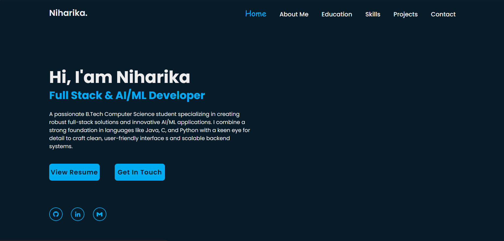
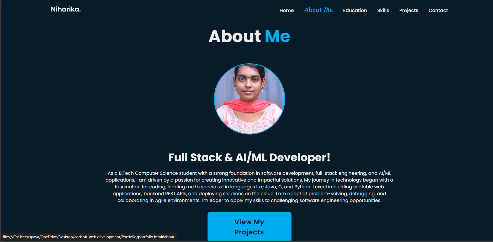
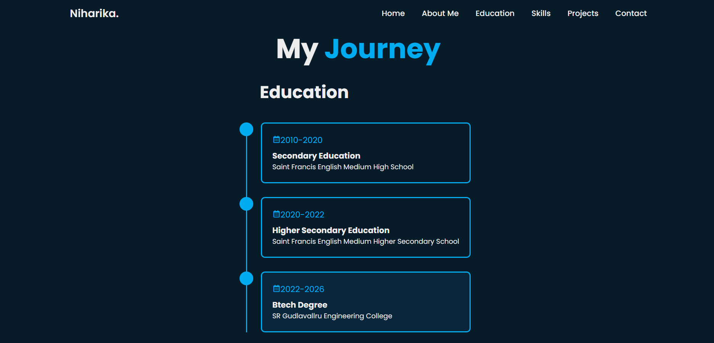
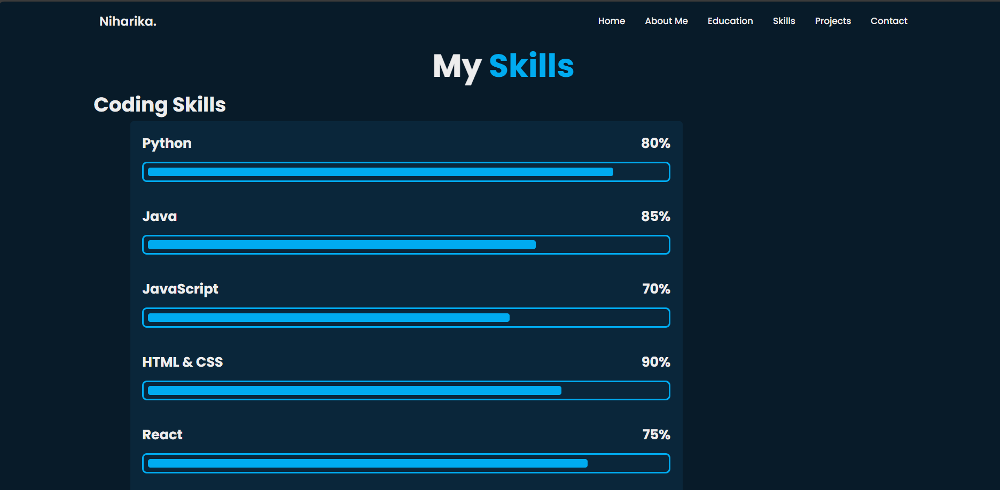
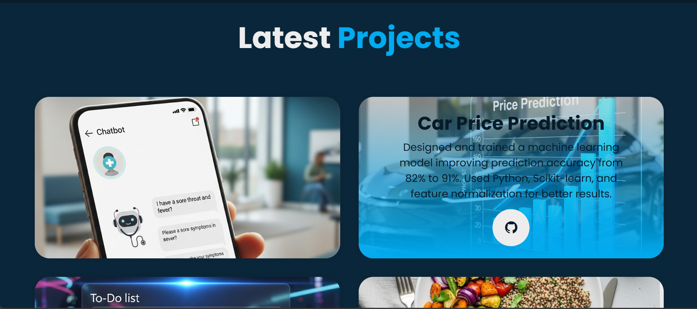
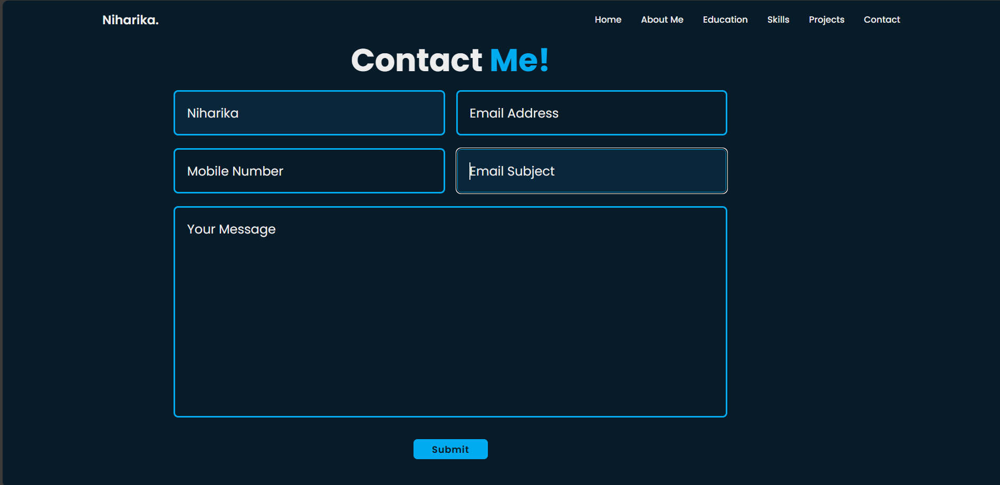

# Niharika's Personal Portfolio

This is a personal portfolio website for Niharika, showcasing her skills, projects, and educational background as a Full Stack & AI/ML Developer. The site is designed to be a professional representation of her work and expertise.

## Features

- **Responsive Design:** The website is built to be accessible and visually appealing on various devices, from desktops to mobile phones.
- **Interactive Navigation:** Smooth, fixed navigation bar with hover effects that highlights the current section.
- **Dynamic Content:** Sections for different parts of the portfolio, including:
    - **Home:** An introduction to Niharika and her professional focus.
    - **About Me:** A detailed description of her background and passion for technology.
    - **Education:** A timeline of her academic journey.
    - **Skills:** A visual representation of her coding skills with progress bars.
    - **Projects:** A gallery of her latest projects with detailed descriptions and links to GitHub.
    - **Contact:** A functional contact form for visitors to get in touch.
- **Smooth Animations:** Subtle animations, like the "showRight" effect and hover transitions, create a modern and engaging user experience.
- **Social Integration:** Links to her GitHub, LinkedIn, and email for easy access.

## Technologies Used

- **HTML5:** For the website's structure and content.
- **CSS3:** For styling, layout, and animations.
- **Boxicons:** A free collection of high-quality SVG icons.

## Screenshots










(projectspage2.png)




## How to Run

1.  **Clone the repository:**
    ```bash
    git clone [https://github.com/Niharika-Sreekakulapu/your-repo-name.git](https://github.com/Niharika-Sreekakulapu/Portfolio.git)
    ```
2.  **Navigate to the project directory:**
    ```bash
    cd Portfolio
    ```
3.  **Open `portfolio.html`:**
    Simply open the `portfolio.html` file in your web browser. There's no need for a server to run this static website.

## Customization

To make this your own portfolio, you can easily customize the following:

- **Content:** Update the text in `portfolio.html` to reflect your personal details, education, skills, and project descriptions.
- **Images:** Replace the placeholder images (`Passport pic.jpg`, `Healthai.png`, etc.) with your own. Ensure the file paths are correctly updated in the HTML.
- **Styling:** Modify the colors, fonts, and layouts in `portfoliostyles.css` to match your personal brand.

## Contact

- **Name:** Niharika Sreekakulapu
- **LinkedIn:** [https://www.linkedin.com/in/niharikasreekakulapu/](https://www.linkedin.com/in/niharikasreekakulapu/)

- **GitHub:** [https://github.com/Niharika-Sreekakulapu/](https://github.com/Niharika-Sreekakulapu/)
